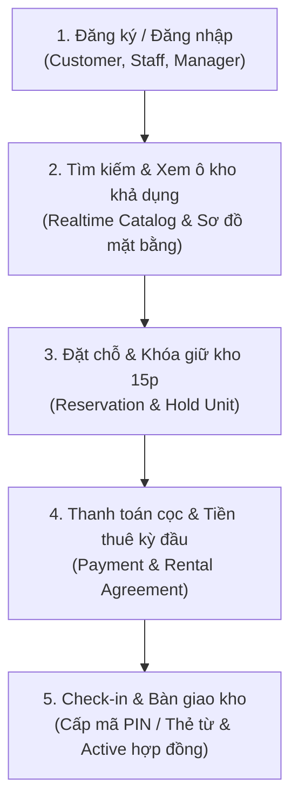
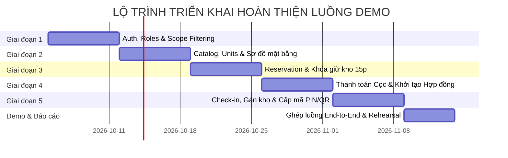

# Kế hoạch Triển khai & Đặc tả Công nghệ (Roadmap & Tech Spec)
## Hệ thống Quản lý và Cho thuê Kho Lưu trữ Tự phục vụ (Self-Storage System)

> **Dự án:** Self-Storage Facility Rental and Management System (PRN222 - Capstone Final Project)  
> **Kiến trúc:** Strict 3-Layer Architecture (.NET 8 Web API + React/Tailwind CSS Frontend + SQL Server Database First)  
> **Mục tiêu tài liệu:** Định nghĩa 5 chức năng cốt lõi tạo thành luồng chạy Demo xuyên suốt (End-to-End Flow), công nghệ áp dụng cho từng chức năng và lộ trình tiến độ chi tiết cho nhóm 5 thành viên.

---

## I. TỔNG QUAN LUỒNG DEMO XUYÊN SUỐT (END-TO-END DEMO FLOW)

Để thuyết trình và demo đồ án thành công trước giảng viên, nhóm không nên làm dàn trải cả 57 bảng mà cần **ưu tiên hoàn thiện 1 luồng nghiệp vụ hoàn chỉnh (Golden Path)** từ đầu đến cuối:

Luồng này kết nối trực tiếp **3 đối tượng người dùng**:
* **Storage Customer**: Tìm kho $\rightarrow$ Giữ chỗ $\rightarrow$ Thanh toán $\rightarrow$ Nhận mã PIN truy cập.
* **Facility Staff / Manager**: Gán ô kho cụ thể $\rightarrow$ Xác minh check-in $\rightarrow$ Kích hoạt bàn giao kho.
* **System**: Tự động giải phóng kho nếu quá 15 phút không thanh toán, tự động sinh hợp đồng và hóa đơn.

---

## II. CHI TIẾT 5 CHỨC NĂNG CỐT LÕI & CÔNG NGHỆ ÁP DỤNG

Mỗi chức năng dưới đây đều giải quyết trọn vẹn một chặng trong quy trình nghiệp vụ của SRS, có giao diện trực quan và áp dụng **ít nhất một công nghệ / kỹ thuật chuyên biệt tối thiểu**:

---

### Chức năng 1: Xác thực, Phân quyền Đa vai trò & Bảo mật Phiên làm việc (Authentication & RBAC)

* **Mục tiêu nghiệp vụ:**
  * Cho phép người dùng đăng ký tài khoản khách hàng, đăng nhập hệ thống.
  * Phân quyền theo 5 vai trò (RBAC): `Storage Customer`, `Facility Staff`, `Facility Manager`, `Business Operations Manager`, `System Administrator`.
  * Ràng buộc phạm vi dữ liệu (`Data Access Scope` theo quy tắc `BR-OPS-01`): Staff và Manager khi đăng nhập chỉ được quản lý dữ liệu thuộc chi nhánh (`facility_id`) mình phụ trách.
* **Công nghệ cốt lõi áp dụng (Tối thiểu 1 công nghệ):**
  1. **JWT (JSON Web Token) + ASP.NET Core Authentication Middleware**: Mã hóa danh tính, Role và `FacilityId` trong Claims để ủy quyền không trạng thái (Stateless).
  2. **BCrypt.Net-Next (hoặc ASP.NET Core PasswordHasher)**: Băm mật khẩu một chiều có salt, chống tấn công dò mật khẩu.
  3. **Refresh Token Flow**: Cấp cặp Access Token (hạn ngắn 15-30 phút) và Refresh Token lưu DB để gia hạn phiên an toàn.
* **Các bảng dữ liệu liên quan (`core` schema):**
  * `core.users`, `core.roles`, `core.user_roles`, `core.customer_profiles`, `core.employee_profiles`, `core.staff_facility_assignments`, `core.login_history`.
* **API Endpoints cần viết:**
  * `POST /api/auth/register`: Đăng ký tài khoản Customer mới.
  * `POST /api/auth/login`: Xác thực tài khoản, trả về JWT Token + Role + Claims.
  * `POST /api/auth/refresh-token`: Cấp lại Access Token mới.
  * `GET /api/auth/me`: Lấy thông tin người dùng hiện tại kèm quyền hạn.
* **Giao diện Front-End:**
  * Màn hình Đăng nhập / Đăng ký hiện đại (Form validation, ghi nhớ tài khoản).
  * Điều hướng phân quyền giao diện (Protected Routes) theo Role người dùng.

---

### Chức năng 2: Tra cứu, Lọc & Hiển thị Trạng thái Ô kho Khả dụng theo Thời gian thực (Facility & Storage Unit Catalog)

* **Mục tiêu nghiệp vụ:**
  * Khách hàng tìm kiếm các điểm kho (`Facilities`) theo vị trí địa lý, quận/huyện.
  * Xem danh mục loại kho (`Unit Types`: kho mát có kiểm soát nhiệt độ, kho tiêu chuẩn, kho ngoài trời).
  * Xem danh sách các ô kho cụ thể (`storage_units`) đang ở trạng thái `Available` (sẵn sàng cho thuê), giá thuê niêm yết theo diện tích/thể tích, sơ đồ vị trí ô kho.
  * Tuân thủ quy tắc `BR-OPS-02`: Tuyệt đối không hiển thị các ô kho đang `In-Use` hoặc `Under Maintenance`.
* **Công nghệ cốt lõi áp dụng (Tối thiểu 1 công nghệ):**
  1. **Entity Framework Core AsNoTracking + Specification/Dynamic LINQ Query**: Tối ưu hóa truy vấn Read-only với tốc độ cao, hỗ trợ phân trang chuẩn `PagedResult<T>`.
  2. **Interactive Visual Floor Plan (Sơ đồ mặt bằng tương tác bằng HTML5 Canvas / SVG / Tailwind CSS Grid)**: Trực quan hóa sơ đồ mặt bằng điểm kho, hiển thị trạng thái màu sắc của từng ô kho (Xanh: Trống, Đỏ: Đang thuê, Vàng: Đang giữ chỗ, Xám: Bảo trì).
* **Các bảng dữ liệu liên quan (`core` schema):**
  * `core.facilities`, `core.facility_areas`, `core.unit_types`, `core.storage_units`, `core.facility_rates`, `core.unit_map_positions`.
* **API Endpoints cần viết:**
  * `GET /api/facilities`: Danh sách các chi nhánh điểm kho kèm bộ lọc thành phố/quận.
  * `GET /api/facilities/{id}/unit-types`: Danh sách các loại ô kho tại cơ sở kèm giá thuê.
  * `GET /api/facilities/{id}/units/available`: Danh sách các ô kho đang khả dụng để đặt chỗ.
  * `GET /api/facilities/{id}/floor-map`: Lấy tọa độ sơ đồ vị trí các ô kho (`unit_map_positions`).
* **Giao diện Front-End:**
  * Trang tìm kiếm và lọc kho theo ngân sách, kích thước, điều hòa nhiệt độ.
  * Bản đồ sơ đồ kho trực quan click chọn ô kho trực tiếp.

---

### Chức năng 3: Đặt chỗ & Cơ chế Khóa giữ Ô kho Tạm thời 15 phút (Reservation & Hold Unit Mechanism)

* **Mục tiêu nghiệp vụ:**
  * Khách hàng chọn cơ sở, loại kho, ngày bắt đầu và thời hạn thuê (tối thiểu 1 tháng, tối đa 12 tháng theo `BR-RSV-02`).
  * Thực thi quy tắc **`BR-RSV-01` (Hold Unit)**: Khi khách nhấn "Đặt chỗ", hệ thống lập tức khóa giữ ô kho/loại kho trong tối đa **15 phút** (chuyển trạng thái sang `Pending Payment`).
  * **Xử lý tự động hết hạn**: Nếu sau 15 phút khách không hoàn tất thanh toán, hệ thống tự động hủy đơn (`Expired`) và mở lại ô kho về trạng thái `Available` cho người khác thuê.
  * Chống Race-condition: Hai khách hàng không thể cùng đặt giữ một ô kho tại một thời điểm.
* **Công nghệ cốt lõi áp dụng (Tối thiểu 1 công nghệ):**
  1. **.NET BackgroundService (IHostedService Worker / Quartz.NET Scheduler)**: Tiến trình chạy ngầm quét định kỳ (mỗi 1 phút) kiểm tra các reservation quá hạn 15 phút chưa thanh toán để tự động hủy đơn và giải phóng kho.
  2. **Database Concurrency Control (Optimistic Concurrency / EF Core RowVersion)**: Xử lý tranh chấp dữ liệu khi nhiều người dùng cùng bấm giữ một ô kho tại cùng một giây.
* **Các bảng dữ liệu liên quan (`core` schema):**
  * `core.reservations`, `core.unit_allocations` (với `allocation_kind = 'reservation_hold'`), `core.storage_units`.
* **API Endpoints cần viết:**
  * `POST /api/reservations`: Tạo đơn đặt chỗ mới, tạm giữ ô kho và trả về thời gian hết hạn (`expires_at = now + 15m`).
  * `GET /api/reservations/{id}`: Xem chi tiết đơn đặt chỗ và đồng hồ đếm ngược.
  * `POST /api/reservations/{id}/cancel`: Khách chủ động hủy giữ chỗ trước hạn.
* **Giao diện Front-End:**
  * Màn hình tóm tắt đơn đặt kho kèm **Đồng hồ đếm ngược thời gian giữ chỗ (Countdown Timer 15:00 $\rightarrow$ 00:00)**.
  * Thông báo cảnh báo khi sắp hết hạn hoặc tự động chuyển hướng nếu hết hạn giữ chỗ.

---

### Chức năng 4: Thanh toán Cọc, Tiền thuê & Kích hoạt Hợp đồng (Payment, Deposit & Rental Agreement)

* **Mục tiêu nghiệp vụ:**
  * Tự động tính toán các khoản chi phí theo quy tắc tài chính:
    * Tiền cọc bảo đảm (`Security Deposit`) = 100% tiền thuê 01 tháng theo quy tắc `BR-FIN-01`.
    * Tiền thuê kỳ đầu tiên theo số tháng đăng ký.
    * Áp dụng mã giảm giá / Voucher (nếu có, tối đa 1 voucher theo `BR-FIN-04`).
  * Tích hợp cổng thanh toán trực tuyến.
  * Sau khi thanh toán thành công:
    * Tạo hóa đơn (`invoices`, `invoice_lines`).
    * Ghi nhận giao dịch (`payments`, `payment_allocations`).
    * Tạo Hợp đồng thuê kho (`rental_agreements`) ở trạng thái chờ bàn giao.
    * Đơn đặt chỗ chuyển sang trạng thái `Confirmed`.
* **Công nghệ cốt lõi áp dụng (Tối thiểu 1 công nghệ):**
  1. **Payment Gateway Integration (Cổng thanh toán trực tuyến)**: Tích hợp cổng thanh toán giả lập có tạo mã **VietQR (NAPAS 247)** động hoặc cổng **VNPay Sandbox / MoMo Payment**.
  2. **Database Transaction Management (`IDbContextTransaction`)**: Đảm bảo tính toàn vẹn tuyệt đối (ACID) của giao dịch tài chính: ghi nhận thanh toán, xuất hóa đơn và khởi tạo hợp đồng phải cùng thành công hoặc cùng rollback nếu gặp lỗi.
* **Các bảng dữ liệu liên quan (`core` schema):**
  * `core.invoices`, `core.invoice_lines`, `core.payments`, `core.payment_allocations`, `core.rental_agreements`, `core.promotions`, `core.promotion_redemptions`.
* **API Endpoints cần viết:**
  * `POST /api/payments/checkout`: Tạo yêu cầu thanh toán cho đơn đặt chỗ, trả về URL cổng thanh toán hoặc mã VietQR chuyển khoản.
  * `POST /api/payments/callback` hoặc `webhook`: Xử lý kết quả trả về từ cổng thanh toán, cập nhật hóa đơn và sinh hợp đồng.
  * `GET /api/invoices/{id}`: Tra cứu hóa đơn điện tử.
  * `GET /api/agreements/{id}`: Tra cứu hợp đồng thuê kho vừa được khởi tạo.
* **Giao diện Front-End:**
  * Trang thanh toán chuyên nghiệp với lựa chọn phương thức (VNPay, VietQR, Thẻ quốc tế).
  * Popup hiển thị mã VietQR chuyển khoản tự động kèm thông tin số tiền và nội dung chuyển khoản.
  * Trang xác nhận thanh toán thành công (Success Receipt).

---

### Chức năng 5: Thủ tục Check-in, Gán kho Cụ thể & Bàn giao Mã PIN/Thẻ từ (Check-in & Digital Handover)

* **Mục tiêu nghiệp vụ:**
  * Khách hàng mang Mã Đặt Chỗ (`Reservation Code`) đến cơ sở kho theo lịch hẹn.
  * Nhân viên kho (`Facility Staff`) tra cứu thông tin đặt chỗ trên hệ thống.
  * Quản lý (`Facility Manager`) hoặc Nhân viên gán chính xác mã số ô kho thực tế (`storage_unit_id`) cho khách (theo quy tắc `BR-RSV-03`).
  * Thực hiện thủ tục kiểm tra định danh (`identity_verifications`) khớp với CCCD/Hộ chiếu (theo `BR-RSV-04`).
  * Khởi tạo phương thức truy cập: Cấp mã PIN điện tử, thẻ từ hoặc chìa khóa cơ (`access_credentials`).
  * Lập biên bản bàn giao điện tử (`handover_records`), chuyển hợp đồng sang trạng thái có hiệu lực (`Active`) và ô kho chuyển sang `Occupied`.
* **Công nghệ cốt lõi áp dụng (Tối thiểu 1 công nghệ):**
  1. **QRCoder / Barcode Generator**: Tự động sinh mã QR định danh cho đơn đặt chỗ trên App của khách hàng để Staff dùng máy quét hoặc camera quét xác thực tức thì trong 3 giây.
  2. **MailKit / FluentEmail + Template HTML**: Tự động gửi Email xác nhận bàn giao kho thành công, đính kèm biên bản bàn giao và mã PIN truy cập ô kho riêng tư cho khách hàng ngay khi hoàn tất check-in.
  3. **Cryptographic Secure PIN Generation**: Thuật toán sinh mã PIN bảo mật ngẫu nhiên (6 chữ số) không trùng lặp và lưu trữ bảo mật trong `access_credentials`.
* **Các bảng dữ liệu liên quan (`core` schema):**
  * `core.handover_records`, `core.access_credentials`, `core.access_points`, `core.identity_verifications`, `core.rental_agreements`, `core.storage_units`, `core.unit_allocations` (chuyển sang `allocation_kind = 'rental'`).
* **API Endpoints cần viết:**
  * `GET /api/staff/check-in/search?code={reservationCode}`: Staff tra cứu đơn đặt chỗ cần check-in.
  * `POST /api/staff/check-in/verify-id`: Xác nhận thông tin CCCD/Hộ chiếu người nhận kho.
  * `POST /api/staff/check-in/assign-unit`: Gán ô kho cụ thể cho đơn đặt chỗ.
  * `POST /api/staff/check-in/complete`: Hoàn tất bàn giao, sinh mã PIN, kích hoạt hợp đồng và gửi Email thông báo.
* **Giao diện Front-End:**
  * Phía Khách hàng: Màn hình "My Unit" hiển thị thẻ ô kho đã kích hoạt, nút "Hiện mã PIN", mã QR check-in.
  * Phía Staff: Cổng làm việc tại quầy (Staff Desk Dashboard) hỗ trợ quét QR, đối soát giấy tờ và bấm nút 1-click bàn giao kho.

---

## III. BẢNG TỔNG HỢP MA TRẬN 5 CHỨC NĂNG VS CÔNG NGHỆ ÁP DỤNG

| STT | Tên Chức năng Cốt lõi | Đối tượng phục vụ | Công nghệ cốt lõi tối thiểu | Thư viện / Package đề xuất |
| :---: | :--- | :--- | :--- | :--- |
| **1** | **Authentication & RBAC** | Customer, Staff, Manager, Admin | • JWT Authentication • Password Hashing & Salts • Claims-based Data Scope | • `System.IdentityModel.Tokens.Jwt` • `Microsoft.AspNetCore.Authentication.JwtBearer` • `BCrypt.Net-Next` |
| **2** | **Facility & Unit Realtime Catalog** | Storage Customer, Public | • Dynamic LINQ & Projection • Interactive SVG/Canvas Floor Plan | • EF Core `AsNoTracking()` • HTML5 Canvas / SVG rendering • Tailwind CSS UI Components |
| **3** | **Reservation & 15-Minute Hold Unit** | Storage Customer, System | • Background Worker Service • Concurrency Token Handling | • .NET `BackgroundService` (`IHostedService`) • EF Core `IsRowVersion` / `IsConcurrencyToken` |
| **4** | **Payment, Deposit & Agreement** | Customer, Financial System | • Cổng thanh toán trực tuyến / VietQR • Database Transactions (ACID) | • `IDbContextTransaction` • VNPay SDK hoặc API VietQR (QuickLink) |
| **5** | **Check-in & Digital Handover** | Facility Staff, Customer | • QR Code Engine • Automated Email Notification • Secure PIN Generation | • `QRCoder` • `MailKit` + `MimeKit` • `System.Security.Cryptography` |

---

## IV. LỘ TRÌNH TIẾN ĐỘ THỰC HIỆN (MILESTONES & SPRINT PLAN)

Lộ trình được chia làm **5 giai đoạn (Sprints)** rõ ràng để cả nhóm phối hợp nhịp nhàng giữa Backend và Frontend:

### 📅 Tuần 1: Nền móng & Xác thực (Milestone 1)
* **Backend (.NET)**:
  * Khắc phục Git Conflict trong `README.md`.
  * Viết DTOs và `AuthService`: Đăng ký, Đăng nhập, giải mã JWT Claims (`UserId`, `Role`, `FacilityId`).
  * Viết `AuthController`.
* **Frontend (Tailwind/React)**:
  * Xây dựng layout chung (Navbar, Sidebar cho Staff/Manager, Footer).
  * Màn hình Login, Register, quản lý lưu trữ Access Token trong LocalStorage/Cookies.
* **Tiêu chí hoàn thành (Done Definition):** Đăng nhập được với các tài khoản Customer, Staff, Manager và chuyển đúng trang phân quyền.

### 📅 Tuần 2: Quản lý Điểm kho & Xem Ô kho Khả dụng (Milestone 2)
* **Backend (.NET)**:
  * Viết `FacilityService` & `StorageUnitService`: Lấy danh sách chi nhánh, loại kho, ô kho `Available`.
  * Viết API lấy tọa độ sơ đồ mặt bằng (`unit_map_positions`).
* **Frontend (Tailwind/React)**:
  * Trang tìm kiếm điểm kho (Card hiển thị hình ảnh, địa chỉ, số ô kho còn trống).
  * Màn hình sơ đồ kho trực quan click chọn ô kho theo loại.
* **Tiêu chí hoàn thành:** Khách hàng lọc được kho theo vị trí và nhìn thấy chính xác ô kho nào còn trống.

### 📅 Tuần 3: Quy trình Đặt chỗ & Khóa giữ kho 15 phút (Milestone 3)
* **Backend (.NET)**:
  * Viết `ReservationService`: Tạo đơn đặt chỗ, ghi nhận vào `unit_allocations` loại `reservation_hold`.
  * Viết `BackgroundService` chạy ngầm: Tự động hủy đơn và trả ô kho về `Available` nếu sau 15 phút chưa thanh toán.
* **Frontend (Tailwind/React)**:
  * Màn hình thiết lập thông tin đặt kho (Ngày bắt đầu thuê, số tháng thuê).
  * Trang xác nhận đơn đặt có đồng hồ đếm ngược 15 phút.
* **Tiêu chí hoàn thành:** Bấm đặt chỗ kho lập tức đổi màu sang "Vàng/Giữ chỗ", mở tab ẩn danh khác không thể đặt trùng ô này; để yên 15 phút kho tự động nhả về trạng thái trống.

### 📅 Tuần 4: Thanh toán Cọc, Tiền thuê & Tạo Hợp đồng (Milestone 4)
* **Backend (.NET)**:
  * Viết logic tính tiền cọc (100% 1 tháng) và hóa đơn kỳ đầu.
  * Tích hợp thanh toán: Sinh link thanh toán VNPay Sandbox hoặc tạo mã QR chuyển khoản VietQR tự động.
  * Viết Transaction: Khi thanh toán thành công, tự động tạo `rental_agreements` và hóa đơn `invoices`.
* **Frontend (Tailwind/React)**:
  * Trang Checkout hiển thị bảng chiết tính tiền rõ ràng (Tiền cọc, tiền thuê, tổng cộng).
  * Popup hiển thị mã VietQR hoặc chuyển sang cổng thanh toán.
  * Trang thông báo thanh toán thành công kèm Mã Đặt Chỗ (`Reservation Code`).
* **Tiêu chí hoàn thành:** Thanh toán xong đơn chuyển `Confirmed`, hợp đồng được khởi tạo trong database, sinh mã đặt chỗ.

### 📅 Tuần 5: Quầy Check-in, Bàn giao kho & Cấp Mã PIN Truy cập (Milestone 5)
* **Backend (.NET)**:
  * Tích hợp thư viện `QRCoder` sinh mã QR định danh cho đơn đặt chỗ.
  * Viết API cho Staff: Quét mã đặt chỗ $\rightarrow$ Gán ô kho cụ thể $\rightarrow$ Hoàn tất bàn giao $\rightarrow$ Sinh mã PIN ngẫu nhiên bảo mật lưu `access_credentials`.
  * Tích hợp `MailKit` gửi email chứa mã PIN và hợp đồng điện tử về hòm thư khách hàng.
* **Frontend (Tailwind/React)**:
  * Phía Khách: Màn hình vé điện tử hiển thị mã QR check-in; sau khi nhận kho hiển thị bảng mã PIN mở cửa.
  * Phía Staff: Trang "Staff Reception Desk": Nhập hoặc quét mã reservation, kiểm tra CCCD, bấm "Xác nhận bàn giao".
* **Tiêu chí hoàn thành:** Nhân viên xác nhận check-in xong, ô kho lập tức chuyển sang `Occupied`, khách nhận được email mã PIN và hợp đồng chuyển `Active`.

### 📅 Tuần 6: Khớp nối Luồng Toàn diện & Tổng duyệt Demo (Milestone 6)
* Kiểm thử toàn bộ kịch bản từ Tài khoản Khách $\rightarrow$ Tài khoản Staff $\rightarrow$ Tài khoản Manager.
* Chăm chút UI/UX, thêm toast notification, loading skeleton.
* Chuẩn bị kịch bản thuyết trình (Demo Script).

---

---

## VI. KỊCH BẢN CHẠY DEMO ĐỂ ĐẠT ĐIỂM TỐI ĐA TRƯỚC GIẢNG VIÊN (DEMO SCRIPT)

Khi bảo vệ đồ án, nhóm hãy mở 2 trình duyệt song song (1 bên là **Khách hàng**, 1 bên là **Nhân viên kho**) để demo tính thời gian thực:

1. **Bước 1 (Khách hàng)**: Đăng nhập tài khoản Customer $\rightarrow$ Vào danh sách cơ sở kho $\rightarrow$ Chọn cơ sở Quận 7 $\rightarrow$ Xem sơ đồ kho trực quan $\rightarrow$ Chọn ô kho trống kích thước $3 \times 3\text{m}$.
2. **Bước 2 (Khách hàng)**: Nhấn "Đặt kho" thời hạn 3 tháng $\rightarrow$ Hệ thống lập tức nhảy sang màn hình giữ chỗ có **đồng hồ đếm ngược 15 phút** $\rightarrow$ *Chỉ cho giảng viên thấy bên tab Nhân viên ô kho đó đã tự chuyển sang màu vàng (Pending).*
3. **Bước 3 (Khách hàng)**: Bấm "Thanh toán ngay" $\rightarrow$ Hệ thống sinh mã **VietQR** chuẩn $\rightarrow$ Giả lập quét thanh toán thành công $\rightarrow$ Hệ thống tự động tạo Hợp đồng thuê và cấp **Mã Đặt Chỗ (Reservation Code / QR Code)**.
4. **Bước 4 (Nhân viên Staff tại quầy)**: Khách đến quầy xuất trình mã QR $\rightarrow$ Nhân viên mở màn hình Quầy lễ tân, quét mã $\rightarrow$ Hệ thống hiện thông tin khách hàng và tự động đối chiếu giấy tờ $\rightarrow$ Staff chọn gán ô kho thực tế $\rightarrow$ Bấm nút **"Bàn giao kho"**.
5. **Bước 5 (Nghiệm thu thành công)**:
   * Ô kho trên hệ thống chuyển sang màu đỏ (`Occupied`).
   * Hợp đồng chuyển sang `Active`.
   * Khách hàng mở điện thoại kiểm tra: Ứng dụng đã hiển thị **Mã PIN mở khóa kho**, đồng thời hòm thư Email vừa nhận được email biên bản bàn giao kèm hợp đồng PDF/HTML.

---

> 📄 **File tài liệu này được lưu trữ trực tiếp tại:**  
> `D:\FPT\PRN222\Project\Final_Project\docs\DEMO_ROADMAP_AND_TECH_SPEC.md`
